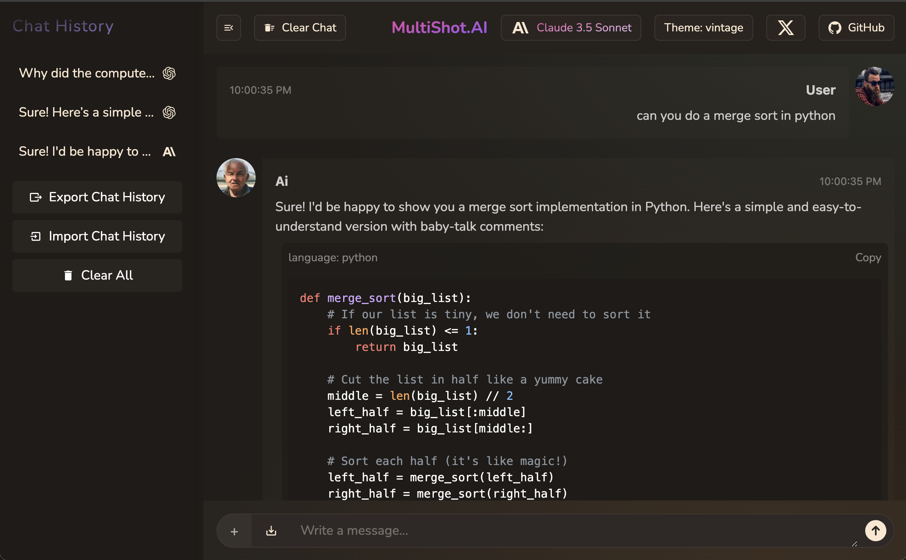

# Stateless UI with [Svelte](https://github.com/fastapi/fastapi) static, [webllm](https://webllm.mlc.ai/), [FastAPI](https://github.com/fastapi/fastapi) and [LangChain](https://github.com/fastapi/fastapi) backend

This project demonstrates how to create a real-time conversational AI by streaming responses from a number of GPT APIs and models. 
It uses FastAPI to create a web server that accepts user inputs and streams generated responses back to the user in a Svelte UI app.

The app also supports the running of LLM's in the browser via [webllm](https://webllm.mlc.ai/). It's a little
experimental feature at the moment, but it does work and it keeps your chats completely private and does not transmit data 
to 3rd party AI companies. 

## Goals
1. App is stateless ✅
   1. Unlike most AI apps with a [Streamlit](https://streamlit.io/), [Gradio](https://www.gradio.app/), [Flask](https://github.com/pallets/flask), and [Django](https://www.djangoproject.com/) UI, to name a couple. 
1. Composability ✅
   1. [Svelte](https://svelte.dev/) ✅ 
      1. version 4 
   2. Embedable and composable design ✅
   3. Serverless ready ✅
   4. CDN support ✅
1. Responsive design for Mobile phones ✅
   1. Mobile first approach ✅
      1. 
   1. [Skeleton](https://www.skeleton.dev/) ✅
   1. [TailWindCSS](https://tailwindcss.com/) ✅
   1. Theme selector and persistence 
   1. Contains UI animations ✅
1. Python backend supporting FastAPI ✅
   1. [LangChain](https://www.langchain.com/) ✅
1. Frontend and backend support multiple models (agentic in nature). The app supports the following API's
   1. [OpenAI](https://platform.openai.com/playground) ✅
   1. [Anthropic](https://console.anthropic.com) ✅
   1. [Ollama](https://ollama.com/) (local/remote) ✅
   1. [Groq](https://console.groq.com/playground) ✅
1. Code highlighting ✅
   1. Copy code button ✅
1. What's next
   1. add web-scraping 
   1. document upload
   1. [webllm](https://webllm.mlc.ai/) ✅
      1. It works but it's experimental
      1. Llama8b or any webllm model 
   1. deletion of chats
   1. workflows
   1. RAG with RAPTOR
   1. ComfyUI server?

## Running the Project
With the addition of running models locally with [webllm](https://webllm.mlc.ai/) in your browser, 
you can run this app without the `python` backend and skip that installation and steps by starting 
at running the UI in the `./ui/` directory with `npm run dev -- --port=3333`. 
Select the `local` toggle button in the UI to download and select the model to run prompts locally 
without sending data over the web. It's a great way to keep your LLM chattery private. 

1. Clone the repository
1. Install Python (Python 3.7+ is recommended).
1. Install necessary libraries. This project uses FastAPI, uvicorn, LangChain, among others. 
   1. In `server` directory run: `pip install -r requirements.txt`.
1. Add your OpenAI API key to the `./server/.env` and use `example.env` as a template in the `server` directory.
1. Start the FastAPI server by running `uvicorn server.main:app --reload`
1. Start the UI
   1. `cd ./ui/` 
   1. `npm install --save-dev vite`
   1. `npm build` - if you want to build for production
   1. `npm run dev -- --port=3333`
1. Your UI will run on `http://localhost:3333/` and your backend on `http://127.0.0.1:8000/static/index.html`.

