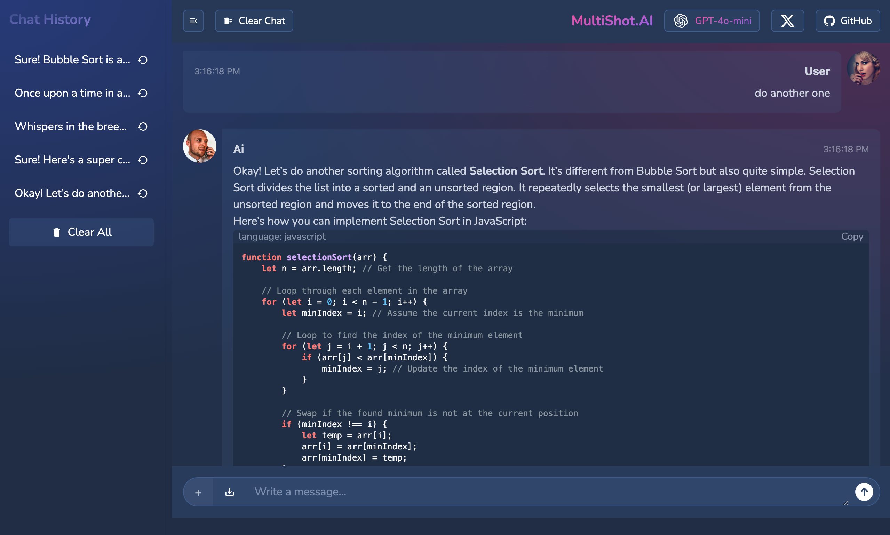

# LangChain with OpenAI GPT Streaming with FastAPI and pure Javascript

This project demonstrates how to create a real-time conversational AI by streaming responses from OpenAI's model(s). 
It uses FastAPI to create a web server that accepts user inputs and streams generated responses back to the user.

## Goals
1. App is stateless
2. UI can sit on a CDN 
3. Python backend supporting Fast.API
4. Frontend and backend support multiple models (agentic in nature). The app supports the following API's
   1. OpenAI
   1. Anthropic
   1. Ollama (local/remote)
   1. Groq

## Running the Project

1. Clone the repository.
2. Install Python (Python 3.7+ is recommended).
3. Install necessary libraries. This project uses FastAPI, uvicorn, LangChain, among others. You can install them with pip: `pip install -r requirements.txt`.
4. Add your OpenAI API key to the `.env` and use `example.env` as a template.
5. Start the FastAPI server by running `uvicorn main:app` in the terminal.
6. Access the application by opening your web browser and navigating to `http://127.0.0.1:8000/static/index.html`.

Note: Ensure the appropriate CORS settings if you're not serving the frontend and the API from the same origin.

## Project Overview

The project uses vanilla HTML that is built by Svelte (not SvelteKit). The user's input is sent to a FastAPI server, 
which forwards it to the GPT model. The generated response is streamed back to the user, simulating a real-time conversation. 
